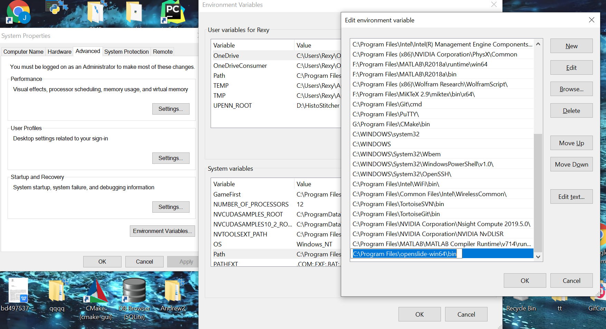

We collect feedbacks and sorted them into a FAQ section here:

## How to Install PyTorch?
---
The general guides for installing Pytorch can be summarized as follows:
1. Check your NVIDIA GPU Compute Capability @ *https://developer.nvidia.com/cuda-gpus* 
2. Download CUDA Toolkit @ *https://developer.nvidia.com/cuda-downloads* 
3. Install PyTorch command can be found @ *https://pytorch.org/get-started/locally/* 
## How to keep track of model ID?  What do they mean? 
---
- For a given project, the database contains the latest model id under the "iteration" column.
- A model_id of -1 means no AI model has been trained at all.
- A model_id of 0 represents the initial autoencoder.
- A model_id of >=1 represents the deep learning iteration.


## How to install OpenSlide?
---
Since PatchSorter currently does not support WSIs, the users need to divide WSI into smaller image tiles.  

However, we received feedbacks that many *Windows* users had difficulty in *OpenSlide*. Therefore, we provide a detailed tutorial for installing and importing *OpenSlide* in *Windows*.
1. Find and install *OpenSlide Python* with proper python version @ *https://pypi.org/project/openslide-python/*
2. Find and install *OpenSlide Window Binaries* @ *https://openslide.org/download/*
3. Add *openslide\bin* to *system environment path*. (Many of our testers forget to add *OpenSlide* to *path*, so they could not import *OpenSlide* properly.)
```
    Control Panel -> System Properties -> Advanced -> Environment Variables 
    -> System variables -> *Path* 
```

<div align="center">
    
</div>


